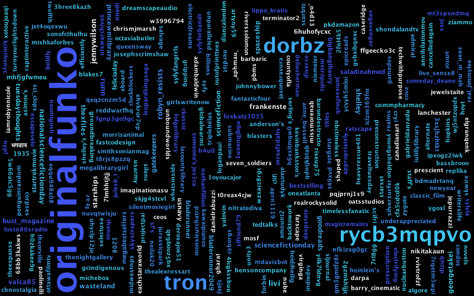

# Creating a Tag Cloud from Tweet Entities

## Problem

You want to make a meaningless word cloud.

## Solution

Use harvesting techniques shown in previous recipes and pass the cloud-destined entities to an R wordcloud package.

## Discussion

Word clouds are virtually devoid of meaning. Neiman Lab went to far as to call them [harmful](http://www.niemanlab.org/2011/10/word-clouds-considered-harmful/). But, this recipe is in the Python version of the book (figures, eh?) and this was desingned to be a 1:1 mapping of said book, so let's proceed.

The folowing uses some handy text taming and word cloud packages to make a collage from `#NationalScienceFictionDay` tweets:

```{r 11_lib, message=FALSE, warning=FALSE}
library(rtweet)
library(tidytext)
library(magick)
library(kumojars) # hrbrmstr/kumojars
library(kumo) # hrbrmstr/kumo
library(tidyverse)
```
```{r 11_nsfd, message=FALSE, warning=FALSE, cache=TRUE}
scifi <- search_tweets("#NationalScienceFictionDay", n=1500)

data_frame(txt=str_replace_all(scifi$text, "#NationalScienceFictionDay", "")) %>% 
  unnest_tokens(word, txt) %>% 
  anti_join(stop_words, "word") %>% 
  anti_join(rtweet::stopwordslangs, "word") %>% 
  anti_join(data_frame(word=c("https", "t.co")), "word") %>% # need to make a more technical stopwords list or clean up the text better
  filter(nchar(word)>3) %>% 
  pull(word) %>% 
  paste0(collapse=" ") -> txt

cloud_img <- word_cloud(txt, width=800, height=500,  min_font_size=10, max_font_size=60, scale="log")

image_write(cloud_img, "data/wordcloud.png")
```



But, seriously, don't make word clouds except for fun.