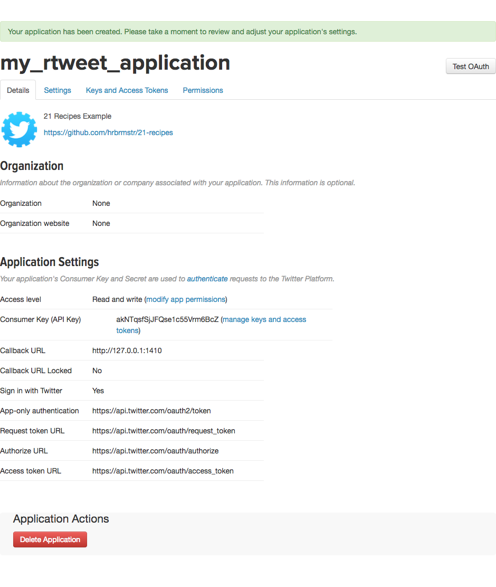

# Using OAuth to Access Twitter APIs

## Problem

You want to access your own data or another user’s data for analysis.

## Solution

Take advantage of Twitter’s OAuth implementation to gain full access to Twitter’s entire API.

## Discussion

Twitter uses [OAuth Core 1.0 Revision A](https://oauth.net/core/1.0a/) ("OAuth 1.0a" for short & to further reduce verbosity, "oauth" from now on). A few, key purposes of oauth in the context of Twitter are:

- to ensure end-users know an application is registered with Twitter, and
- know who the author(s) fo the application are;
- enable limiting what operations an application can perform with your Twitter account;
- obviate the need to share your actual Twitter username and password with a third party, which also 
- enables recovation of application access to your Twitter account without resetting your password.

The `rtweet` package takes this one step further by having _you_ create an "application", which is nothing more than you setting up some basic configuration information. To do so, you must visit [apps.twitter.com](https://apps.twitter.com/) and create a new application. You will need to provide values for the following fields:

- `Name` : something you'll remember 
- `Description` : another place you can remind yourself what this is for
- `Website` : something that points to information you can use to associate this app when you've forgotten about it 5 years from now
- `Callback URL` : This **must** be `http://127.0.0.1:1410` (we'll see why in a moment)
- tick the agreement checkbox


Once you submit that form, you'll see a new page:



Select the "Keys and Access Tokens" tab to see important information you'll need:


From the previous page and this page, you'll need the:

- Application **Name** (which is `my_rtweet_application` in this example but you need to use the one you supplied)
- **Consumer Key (API Key)** (which is `akNTqsfSjJFQse1c55Vrm6BcZ` in this example but you need to use your own)
- **Consumer Secret (API Secret)** (which is `HFF77rxG5HTx4Ui7RbxYVjoyUup5h0ncls92Q88ddE0n4YFJZN` in this example, but --- again --- you need to use your own)

Store both of those in your `~/.Renviron` file. If you're unfamiliar with how to do that, see [this handy section](https://csgillespie.github.io/efficientR/3-3-r-startup.html#renviron) from "Efficient R Programming". I prefer storing these as such:

```
TWITTER_APP=my_rtweet_application
TWITTER_CONSUMER_KEY=akNTqsfSjJFQse1c55Vrm6BcZ
TWITTER_CONSUMER_SECRET=HFF77rxG5HTx4Ui7RbxYVjoyUup5h0ncls92Q88ddE0n4YFJZN
```

By storing these values in `~/.Renviron` you avoid exposing them in subdirectories or within scripts and will always be able to reference them.

Now you can enable your Twitter account with this application and create a _token_:


```r
create_token(
  app = Sys.getenv("TWITTER_APP"),
  consumer_key = Sys.getenv("TWITTER_CONSUMER_KEY"),
  consumer_secret = Sys.getenv("TWITTER_CONSUMER_SECRET")
) -> twitter_token
```

You should see a browser window appear that has an authorization form in it:


You'll also see:

```
Waiting for authentication in browser...
Press Esc/Ctrl + C to abort
```

in the R console.

The `rtweet` package used `httr` to send an oauth request to Twitter and then started up a local web server (this is why that weird `localhost` URL from before is necessary). When you authorize the application, the browser sends a response back to the web server `httr` spun up with some important, secret information that will make it possible for you to never have to do this oauth dance again.

If everything was successful, you'll see:

```
Authentication complete. Please close this page and return to R.
```

in the browser window, and:

```
Authentication complete.
```

in the R console.

The next step is _very important_.

Save the secret token you just received this way:


```r
saveRDS(twitter_token, "~/.rtweet.rds")
```

then create _one more_ environment variable in `~/.Renviron`:

```
TWITTER_PAT=~/.rtweet.rds
```

That last step will help ensure you never have to deal with oauth again (until you want to).

**Keep this token file safe**!! It enables anyone who has it to do virtually anything with your account. If you believe it has been exposed, go back to [apps.twitter.com](https://apps.twitter.com/) and delete the application (you can also choose to regenerate the `Consumer Key` and `Consumer Secret`, but it's often easier to just make a new application). You should also review your [Twitter apps](https://twitter.com/settings/applications) and ensure it's removed from there as well. Use the `Revoke access` button if it is:


## See Also

- The official `rtweet` [authentication vignette](http://rtweet.info/articles/auth.html)
