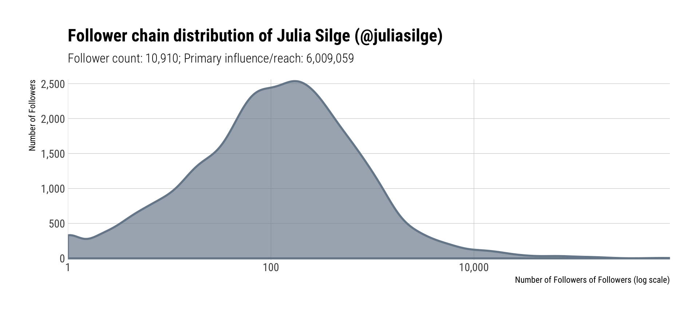
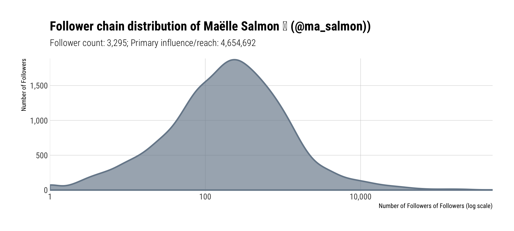

# Crawling Followers to Approximate Primary Influence

## Problem

You want to approximate someone’s influence based upon their popularity and the popularity of their followers.

## Solution

Use the `rtweet::lookup_users()` and `rtweet::get_followers()` combination to pull primary influence and derive "primary influence" based on "followers-of-followers" counts.

## Discussion

"Influence" is _extremely_ more nuanced than both what the original Python chaper delved into and what this exercise shows. Building "#-removed" total reach counts from a large tree traversal (as the Python version suggests) is worthless on face-value since it doesn't take into account how many times any of the 'n-depth' of followers ever retweeted or even favorited content posted by the seminal user over the course of a certain period. Without gathering such stats, multi-depth "followers-of-followers" is nigh meaningliess.

_However_, once-removed (so the follower counts of those directly following the target user) has some merit. Marketing folks have varying names for this statistic, so we'll just call it "primary influece" since there is legitimate potential of reaching this once-removed audience. Ideally, the retweet- and fav-counts should be factored in, but that can be added on as an exercise.

Let's create a helper function that will capture a snapshot of this _priamry influence_ metric. It will take in a user id or name, pull in that user info and the details of their followers and then sum up all the follower counts to get the overall reach number. It returns this information (so it can be processed again without API calls) but also produces a graph of the "number of followers" distribution of the first-level followers. This is usually a heavily skewed distribution so the function also defaults to a log scale, but can be overriden to use a linear scale (log scale will be the correct choice the vast majority of the time, but the fuction can be modified --- as an exercise -- to test the distribution and auto-pick scales).


```r
library(rtweet)
library(hrbrthemes)
library(tidyverse)
```


```r
influence_snapshot <- function(user, trans=c("log10", "identity")) {
  
  user <- user[1]
  trans <- match.arg(tolower(trimws(trans[1])), c("log10", "identity"))
  
  user_info <- lookup_users(user)
  
  user_followers <- get_followers(user_info$user_id)
  uf_details <- lookup_users(user_followers$user_id)
  
  primary_influence <- scales::comma(sum(c(uf_details$followers_count, user_info$followers_count)))
  
  filter(uf_details, followers_count > 0) %>% 
    ggplot(aes(followers_count)) +
    geom_density(aes(y=..count..), color="lightslategray", fill="lightslategray",
                 alpha=2/3, size=1) +
    scale_x_continuous(expand=c(0,0), trans="log10", labels=scales::comma) +
    scale_y_comma() +
    labs(
      x="Number of Followers of Followers (log scale)", 
      y="Number of Followers",
      title=sprintf("Follower chain distribution of %s (@%s)", user_info$name, user_info$screen_name),
      subtitle=sprintf("Follower count: %s; Primary influence/reach: %s", 
                       scales::comma(user_info$followers_count),
                       scales::comma(primary_influence))
    ) +
    theme_ipsum_rc(grid="XY") -> gg
  
  print(gg)
  
  return(invisible(list(user_info=user_info, follower_details=uf_details)))
  
}
```

Let's run it on [Julia Silge](https://twitter.com/juliasilge), an incredibly talented data scientist over at Stack Overflow and co-author of [Tidy Text Mining with R](https://www.tidytextmining.com/) --- a book that should be on your shelf _especially_ if you're doing Twitter mining.


```r
juliasilge <- influence_snapshot("juliasilge")
```



```r
glimpse(juliasilge)
```

```
## List of 2
##  $ user_info       :Classes 'tbl_df', 'tbl' and 'data.frame':	1 obs. of  20 variables:
##   ..$ user_id               : chr "13074042"
##   ..$ name                  : chr "Julia Silge"
##   ..$ screen_name           : chr "juliasilge"
##   ..$ location              : chr "Salt Lake City, UT"
##   ..$ description           : chr "Data science and visualization at Stack Overflow, #rstats, author of Text Mining with R, parenthood, reading, f"| __truncated__
##   ..$ url                   : chr "https://t.co/0LpY8Ihz2B"
##   ..$ protected             : logi FALSE
##   ..$ followers_count       : int 10910
##   ..$ friends_count         : int 445
##   ..$ listed_count          : int 410
##   ..$ statuses_count        : int 16365
##   ..$ favourites_count      : int 19811
##   ..$ account_created_at    : POSIXct[1:1], format: "2008-02-05 00:47:07"
##   ..$ verified              : logi FALSE
##   ..$ profile_url           : chr "https://t.co/0LpY8Ihz2B"
##   ..$ profile_expanded_url  : chr "http://juliasilge.com/"
##   ..$ account_lang          : chr "en"
##   ..$ profile_banner_url    : chr "https://pbs.twimg.com/profile_banners/13074042/1511394461"
##   ..$ profile_background_url: chr "http://abs.twimg.com/images/themes/theme13/bg.gif"
##   ..$ profile_image_url     : chr "http://pbs.twimg.com/profile_images/930639796510244865/D_N-CofS_normal.jpg"
##   ..- attr(*, "tweets")=Classes 'tbl_df', 'tbl' and 'data.frame':	1 obs. of  68 variables:
##   .. ..$ status_id              : chr "949090073693204480"
##   .. ..$ created_at             : POSIXct[1:1], format: "2018-01-05 01:28:01"
##   .. ..$ user_id                : chr "13074042"
##   .. ..$ screen_name            : chr "juliasilge"
##   .. ..$ text                   : chr "RT @statwonk: Analysts, scientists and statisticians know that #bigdata is a joke. Why? Data are uncountable an"| __truncated__
##   .. ..$ source                 : chr "Twitter for iPhone"
##   .. ..$ display_text_width     : int NA
##   .. ..$ reply_to_status_id     : logi NA
##   .. ..$ reply_to_user_id       : logi NA
##   .. ..$ reply_to_screen_name   : logi NA
##   .. ..$ is_quote               : logi FALSE
##   .. ..$ is_retweet             : logi TRUE
##   .. ..$ favorite_count         : int 0
##   .. ..$ retweet_count          : int 6
##   .. ..$ hashtags               :List of 1
##   .. ..$ symbols                :List of 1
##   .. ..$ urls_url               :List of 1
##   .. ..$ urls_t.co              :List of 1
##   .. ..$ urls_expanded_url      :List of 1
##   .. ..$ media_url              :List of 1
##   .. ..$ media_t.co             :List of 1
##   .. ..$ media_expanded_url     :List of 1
##   .. ..$ media_type             :List of 1
##   .. ..$ ext_media_url          :List of 1
##   .. ..$ ext_media_t.co         :List of 1
##   .. ..$ ext_media_expanded_url :List of 1
##   .. ..$ ext_media_type         : chr NA
##   .. ..$ mentions_user_id       :List of 1
##   .. ..$ mentions_screen_name   :List of 1
##   .. ..$ lang                   : chr "en"
##   .. ..$ quoted_status_id       : chr NA
##   .. ..$ quoted_text            : chr NA
##   .. ..$ quoted_created_at      : POSIXct[1:1], format: NA
##   .. ..$ quoted_source          : chr NA
##   .. ..$ quoted_favorite_count  : int NA
##   .. ..$ quoted_retweet_count   : int NA
##   .. ..$ quoted_user_id         : chr NA
##   .. ..$ quoted_screen_name     : chr NA
##   .. ..$ quoted_name            : chr NA
##   .. ..$ quoted_followers_count : int NA
##   .. ..$ quoted_friends_count   : int NA
##   .. ..$ quoted_statuses_count  : int NA
##   .. ..$ quoted_location        : chr NA
##   .. ..$ quoted_description     : chr NA
##   .. ..$ quoted_verified        : logi NA
##   .. ..$ retweet_status_id      : chr "949042404455219201"
##   .. ..$ retweet_text           : chr "Analysts, scientists and statisticians know that #bigdata is a joke. Why? Data are uncountable and infinite. On"| __truncated__
##   .. ..$ retweet_created_at     : POSIXct[1:1], format: "2018-01-04 22:18:36"
##   .. ..$ retweet_source         : chr NA
##   .. ..$ retweet_favorite_count : int 21
##   .. ..$ retweet_user_id        : chr NA
##   .. ..$ retweet_screen_name    : chr NA
##   .. ..$ retweet_name           : chr NA
##   .. ..$ retweet_followers_count: int NA
##   .. ..$ retweet_friends_count  : int NA
##   .. ..$ retweet_statuses_count : int NA
##   .. ..$ retweet_location       : chr NA
##   .. ..$ retweet_description    : chr NA
##   .. ..$ retweet_verified       : logi NA
##   .. ..$ place_url              : chr NA
##   .. ..$ place_name             : chr NA
##   .. ..$ place_full_name        : chr NA
##   .. ..$ place_type             : chr NA
##   .. ..$ country                : chr NA
##   .. ..$ country_code           : chr NA
##   .. ..$ geo_coords             :List of 1
##   .. ..$ coords_coords          :List of 1
##   .. ..$ bbox_coords            :List of 1
##  $ follower_details:Classes 'tbl_df', 'tbl' and 'data.frame':	5000 obs. of  20 variables:
##   ..$ user_id               : chr [1:5000] "30197167" "23437966" "944279909521911809" "934426253708464128" ...
##   ..$ name                  : chr [1:5000] "Surajit Dhar" "Helen Graham" "DouglasiMorgan" "kamex kenneth" ...
##   ..$ screen_name           : chr [1:5000] "nagasuraj" "helngram" "Douglas2Morgan" "KamexKenneth" ...
##   ..$ location              : chr [1:5000] "" "Edinburgh" "" "La Canada Flintridge, CA" ...
##   ..$ description           : chr [1:5000] "" "I torture data for fun and profit. Still a cheesecake enthusiast." "" "Happy" ...
##   ..$ url                   : chr [1:5000] NA NA NA NA ...
##   ..$ protected             : logi [1:5000] TRUE FALSE FALSE FALSE FALSE FALSE ...
##   ..$ followers_count       : int [1:5000] 18 99 243 155 2 6172 56 215 427 5 ...
##   ..$ friends_count         : int [1:5000] 248 382 2806 1521 74 4020 284 884 957 179 ...
##   ..$ listed_count          : int [1:5000] 0 4 0 0 0 201 4 2 53 0 ...
##   ..$ statuses_count        : int [1:5000] 92 771 0 1 13 9720 152 1026 2394 6 ...
##   ..$ favourites_count      : int [1:5000] 30 107 0 8 1 13093 259 612 5479 1 ...
##   ..$ account_created_at    : POSIXct[1:5000], format: "2009-04-10 10:55:17" ...
##   ..$ verified              : logi [1:5000] FALSE FALSE FALSE FALSE FALSE TRUE ...
##   ..$ profile_url           : chr [1:5000] NA NA NA NA ...
##   ..$ profile_expanded_url  : chr [1:5000] NA NA NA NA ...
##   ..$ account_lang          : chr [1:5000] "en" "en" "en" "en" ...
##   ..$ profile_banner_url    : chr [1:5000] NA "https://pbs.twimg.com/profile_banners/23437966/1362861613" "https://pbs.twimg.com/profile_banners/944279909521911809/1513973832" NA ...
##   ..$ profile_background_url: chr [1:5000] "http://abs.twimg.com/images/themes/theme1/bg.png" "http://pbs.twimg.com/profile_background_images/5966931/xmas_002.jpg" NA NA ...
##   ..$ profile_image_url     : chr [1:5000] "http://pbs.twimg.com/profile_images/3619425574/017e3c69373add7399c0689d70d5e3b5_normal.jpeg" "http://pbs.twimg.com/profile_images/378800000858153027/-lbO7veR_normal.jpeg" "http://pbs.twimg.com/profile_images/944301258415984640/NY--VNaG_normal.jpg" "http://pbs.twimg.com/profile_images/934426923584966657/GJUKnQuG_normal.jpg" ...
##   ..- attr(*, "tweets")=Classes 'tbl_df', 'tbl' and 'data.frame':	5000 obs. of  68 variables:
##   .. ..$ status_id              : chr [1:5000] NA "949208591524945920" NA "934660498246852608" ...
##   .. ..$ created_at             : POSIXct[1:5000], format: NA ...
##   .. ..$ user_id                : chr [1:5000] "30197167" "23437966" "944279909521911809" "934426253708464128" ...
##   .. ..$ screen_name            : chr [1:5000] "nagasuraj" "helngram" "Douglas2Morgan" "KamexKenneth" ...
##   .. ..$ text                   : chr [1:5000] NA "Every time you drink raw water, somewhere in the great beyond Darwin does a massive facepalm but also feels a bit vindicated." NA "@ConnLoraine Lovely" ...
##   .. ..$ source                 : chr [1:5000] NA "Twitter for Android" NA "Twitter for iPhone" ...
##   .. ..$ display_text_width     : int [1:5000] NA NA NA NA NA NA NA NA NA NA ...
##   .. ..$ reply_to_status_id     : chr [1:5000] NA NA NA "934643010813358081" ...
##   .. ..$ reply_to_user_id       : chr [1:5000] NA NA NA "893460901470154752" ...
##   .. ..$ reply_to_screen_name   : chr [1:5000] NA NA NA "ConnLoraine" ...
##   .. ..$ is_quote               : logi [1:5000] FALSE FALSE FALSE FALSE FALSE FALSE ...
##   .. ..$ is_retweet             : logi [1:5000] FALSE FALSE FALSE FALSE FALSE FALSE ...
##   .. ..$ favorite_count         : int [1:5000] NA 0 NA 46 0 4 1 0 0 0 ...
##   .. ..$ retweet_count          : int [1:5000] NA 0 NA 7 0 0 0 96 64 0 ...
##   .. ..$ hashtags               :List of 5000
##   .. ..$ symbols                :List of 5000
##   .. ..$ urls_url               :List of 5000
##   .. ..$ urls_t.co              :List of 5000
##   .. ..$ urls_expanded_url      :List of 5000
##   .. ..$ media_url              :List of 5000
##   .. ..$ media_t.co             :List of 5000
##   .. ..$ media_expanded_url     :List of 5000
##   .. ..$ media_type             :List of 5000
##   .. ..$ ext_media_url          :List of 5000
##   .. ..$ ext_media_t.co         :List of 5000
##   .. ..$ ext_media_expanded_url :List of 5000
##   .. ..$ ext_media_type         : chr [1:5000] NA NA NA NA ...
##   .. ..$ mentions_user_id       :List of 5000
##   .. ..$ mentions_screen_name   :List of 5000
##   .. ..$ lang                   : chr [1:5000] NA "en" NA "en" ...
##   .. ..$ quoted_status_id       : chr [1:5000] NA NA NA NA ...
##   .. ..$ quoted_text            : chr [1:5000] NA NA NA NA ...
##   .. ..$ quoted_created_at      : POSIXct[1:5000], format: NA ...
##   .. ..$ quoted_source          : chr [1:5000] NA NA NA NA ...
##   .. ..$ quoted_favorite_count  : int [1:5000] NA NA NA NA NA NA NA NA NA NA ...
##   .. ..$ quoted_retweet_count   : int [1:5000] NA NA NA NA NA NA NA NA NA NA ...
##   .. ..$ quoted_user_id         : chr [1:5000] NA NA NA NA ...
##   .. ..$ quoted_screen_name     : chr [1:5000] NA NA NA NA ...
##   .. ..$ quoted_name            : chr [1:5000] NA NA NA NA ...
##   .. ..$ quoted_followers_count : int [1:5000] NA NA NA NA NA NA NA NA NA NA ...
##   .. ..$ quoted_friends_count   : int [1:5000] NA NA NA NA NA NA NA NA NA NA ...
##   .. ..$ quoted_statuses_count  : int [1:5000] NA NA NA NA NA NA NA NA NA NA ...
##   .. ..$ quoted_location        : chr [1:5000] NA NA NA NA ...
##   .. ..$ quoted_description     : chr [1:5000] NA NA NA NA ...
##   .. ..$ quoted_verified        : logi [1:5000] NA NA NA NA NA NA ...
##   .. ..$ retweet_status_id      : chr [1:5000] NA NA NA NA ...
##   .. ..$ retweet_text           : chr [1:5000] NA NA NA NA ...
##   .. ..$ retweet_created_at     : POSIXct[1:5000], format: NA ...
##   .. ..$ retweet_source         : chr [1:5000] NA NA NA NA ...
##   .. ..$ retweet_favorite_count : int [1:5000] NA NA NA NA NA NA NA 169 162 NA ...
##   .. ..$ retweet_user_id        : chr [1:5000] NA NA NA NA ...
##   .. ..$ retweet_screen_name    : chr [1:5000] NA NA NA NA ...
##   .. ..$ retweet_name           : chr [1:5000] NA NA NA NA ...
##   .. ..$ retweet_followers_count: int [1:5000] NA NA NA NA NA NA NA NA NA NA ...
##   .. ..$ retweet_friends_count  : int [1:5000] NA NA NA NA NA NA NA NA NA NA ...
##   .. ..$ retweet_statuses_count : int [1:5000] NA NA NA NA NA NA NA NA NA NA ...
##   .. ..$ retweet_location       : chr [1:5000] NA NA NA NA ...
##   .. ..$ retweet_description    : chr [1:5000] NA NA NA NA ...
##   .. ..$ retweet_verified       : logi [1:5000] NA NA NA NA NA NA ...
##   .. ..$ place_url              : chr [1:5000] NA NA NA NA ...
##   .. ..$ place_name             : chr [1:5000] NA NA NA NA ...
##   .. ..$ place_full_name        : chr [1:5000] NA NA NA NA ...
##   .. ..$ place_type             : chr [1:5000] NA NA NA NA ...
##   .. ..$ country                : chr [1:5000] NA NA NA NA ...
##   .. ..$ country_code           : chr [1:5000] NA NA NA NA ...
##   .. ..$ geo_coords             :List of 5000
##   .. ..$ coords_coords          :List of 5000
##   .. ..$ bbox_coords            :List of 5000
```

You'll see that distribution shape quite a bit given the general nature of the social structure of Twitter. Don't believe that? Let's do one more, this time for [Maëlle Salmon](https://twitter.com/ma_salmon/), another incredibly talented data scientist with a [blog](http://www.masalmon.eu/) you _must_ follow if you want to learn how to do fun and useful things with R.L


```r
ma_salmon <- influence_snapshot("ma_salmon")
```



```r
glimpse(juliasilge)
```

```
## List of 2
##  $ user_info       :Classes 'tbl_df', 'tbl' and 'data.frame':	1 obs. of  20 variables:
##   ..$ user_id               : chr "13074042"
##   ..$ name                  : chr "Julia Silge"
##   ..$ screen_name           : chr "juliasilge"
##   ..$ location              : chr "Salt Lake City, UT"
##   ..$ description           : chr "Data science and visualization at Stack Overflow, #rstats, author of Text Mining with R, parenthood, reading, f"| __truncated__
##   ..$ url                   : chr "https://t.co/0LpY8Ihz2B"
##   ..$ protected             : logi FALSE
##   ..$ followers_count       : int 10910
##   ..$ friends_count         : int 445
##   ..$ listed_count          : int 410
##   ..$ statuses_count        : int 16365
##   ..$ favourites_count      : int 19811
##   ..$ account_created_at    : POSIXct[1:1], format: "2008-02-05 00:47:07"
##   ..$ verified              : logi FALSE
##   ..$ profile_url           : chr "https://t.co/0LpY8Ihz2B"
##   ..$ profile_expanded_url  : chr "http://juliasilge.com/"
##   ..$ account_lang          : chr "en"
##   ..$ profile_banner_url    : chr "https://pbs.twimg.com/profile_banners/13074042/1511394461"
##   ..$ profile_background_url: chr "http://abs.twimg.com/images/themes/theme13/bg.gif"
##   ..$ profile_image_url     : chr "http://pbs.twimg.com/profile_images/930639796510244865/D_N-CofS_normal.jpg"
##   ..- attr(*, "tweets")=Classes 'tbl_df', 'tbl' and 'data.frame':	1 obs. of  68 variables:
##   .. ..$ status_id              : chr "949090073693204480"
##   .. ..$ created_at             : POSIXct[1:1], format: "2018-01-05 01:28:01"
##   .. ..$ user_id                : chr "13074042"
##   .. ..$ screen_name            : chr "juliasilge"
##   .. ..$ text                   : chr "RT @statwonk: Analysts, scientists and statisticians know that #bigdata is a joke. Why? Data are uncountable an"| __truncated__
##   .. ..$ source                 : chr "Twitter for iPhone"
##   .. ..$ display_text_width     : int NA
##   .. ..$ reply_to_status_id     : logi NA
##   .. ..$ reply_to_user_id       : logi NA
##   .. ..$ reply_to_screen_name   : logi NA
##   .. ..$ is_quote               : logi FALSE
##   .. ..$ is_retweet             : logi TRUE
##   .. ..$ favorite_count         : int 0
##   .. ..$ retweet_count          : int 6
##   .. ..$ hashtags               :List of 1
##   .. ..$ symbols                :List of 1
##   .. ..$ urls_url               :List of 1
##   .. ..$ urls_t.co              :List of 1
##   .. ..$ urls_expanded_url      :List of 1
##   .. ..$ media_url              :List of 1
##   .. ..$ media_t.co             :List of 1
##   .. ..$ media_expanded_url     :List of 1
##   .. ..$ media_type             :List of 1
##   .. ..$ ext_media_url          :List of 1
##   .. ..$ ext_media_t.co         :List of 1
##   .. ..$ ext_media_expanded_url :List of 1
##   .. ..$ ext_media_type         : chr NA
##   .. ..$ mentions_user_id       :List of 1
##   .. ..$ mentions_screen_name   :List of 1
##   .. ..$ lang                   : chr "en"
##   .. ..$ quoted_status_id       : chr NA
##   .. ..$ quoted_text            : chr NA
##   .. ..$ quoted_created_at      : POSIXct[1:1], format: NA
##   .. ..$ quoted_source          : chr NA
##   .. ..$ quoted_favorite_count  : int NA
##   .. ..$ quoted_retweet_count   : int NA
##   .. ..$ quoted_user_id         : chr NA
##   .. ..$ quoted_screen_name     : chr NA
##   .. ..$ quoted_name            : chr NA
##   .. ..$ quoted_followers_count : int NA
##   .. ..$ quoted_friends_count   : int NA
##   .. ..$ quoted_statuses_count  : int NA
##   .. ..$ quoted_location        : chr NA
##   .. ..$ quoted_description     : chr NA
##   .. ..$ quoted_verified        : logi NA
##   .. ..$ retweet_status_id      : chr "949042404455219201"
##   .. ..$ retweet_text           : chr "Analysts, scientists and statisticians know that #bigdata is a joke. Why? Data are uncountable and infinite. On"| __truncated__
##   .. ..$ retweet_created_at     : POSIXct[1:1], format: "2018-01-04 22:18:36"
##   .. ..$ retweet_source         : chr NA
##   .. ..$ retweet_favorite_count : int 21
##   .. ..$ retweet_user_id        : chr NA
##   .. ..$ retweet_screen_name    : chr NA
##   .. ..$ retweet_name           : chr NA
##   .. ..$ retweet_followers_count: int NA
##   .. ..$ retweet_friends_count  : int NA
##   .. ..$ retweet_statuses_count : int NA
##   .. ..$ retweet_location       : chr NA
##   .. ..$ retweet_description    : chr NA
##   .. ..$ retweet_verified       : logi NA
##   .. ..$ place_url              : chr NA
##   .. ..$ place_name             : chr NA
##   .. ..$ place_full_name        : chr NA
##   .. ..$ place_type             : chr NA
##   .. ..$ country                : chr NA
##   .. ..$ country_code           : chr NA
##   .. ..$ geo_coords             :List of 1
##   .. ..$ coords_coords          :List of 1
##   .. ..$ bbox_coords            :List of 1
##  $ follower_details:Classes 'tbl_df', 'tbl' and 'data.frame':	5000 obs. of  20 variables:
##   ..$ user_id               : chr [1:5000] "30197167" "23437966" "944279909521911809" "934426253708464128" ...
##   ..$ name                  : chr [1:5000] "Surajit Dhar" "Helen Graham" "DouglasiMorgan" "kamex kenneth" ...
##   ..$ screen_name           : chr [1:5000] "nagasuraj" "helngram" "Douglas2Morgan" "KamexKenneth" ...
##   ..$ location              : chr [1:5000] "" "Edinburgh" "" "La Canada Flintridge, CA" ...
##   ..$ description           : chr [1:5000] "" "I torture data for fun and profit. Still a cheesecake enthusiast." "" "Happy" ...
##   ..$ url                   : chr [1:5000] NA NA NA NA ...
##   ..$ protected             : logi [1:5000] TRUE FALSE FALSE FALSE FALSE FALSE ...
##   ..$ followers_count       : int [1:5000] 18 99 243 155 2 6172 56 215 427 5 ...
##   ..$ friends_count         : int [1:5000] 248 382 2806 1521 74 4020 284 884 957 179 ...
##   ..$ listed_count          : int [1:5000] 0 4 0 0 0 201 4 2 53 0 ...
##   ..$ statuses_count        : int [1:5000] 92 771 0 1 13 9720 152 1026 2394 6 ...
##   ..$ favourites_count      : int [1:5000] 30 107 0 8 1 13093 259 612 5479 1 ...
##   ..$ account_created_at    : POSIXct[1:5000], format: "2009-04-10 10:55:17" ...
##   ..$ verified              : logi [1:5000] FALSE FALSE FALSE FALSE FALSE TRUE ...
##   ..$ profile_url           : chr [1:5000] NA NA NA NA ...
##   ..$ profile_expanded_url  : chr [1:5000] NA NA NA NA ...
##   ..$ account_lang          : chr [1:5000] "en" "en" "en" "en" ...
##   ..$ profile_banner_url    : chr [1:5000] NA "https://pbs.twimg.com/profile_banners/23437966/1362861613" "https://pbs.twimg.com/profile_banners/944279909521911809/1513973832" NA ...
##   ..$ profile_background_url: chr [1:5000] "http://abs.twimg.com/images/themes/theme1/bg.png" "http://pbs.twimg.com/profile_background_images/5966931/xmas_002.jpg" NA NA ...
##   ..$ profile_image_url     : chr [1:5000] "http://pbs.twimg.com/profile_images/3619425574/017e3c69373add7399c0689d70d5e3b5_normal.jpeg" "http://pbs.twimg.com/profile_images/378800000858153027/-lbO7veR_normal.jpeg" "http://pbs.twimg.com/profile_images/944301258415984640/NY--VNaG_normal.jpg" "http://pbs.twimg.com/profile_images/934426923584966657/GJUKnQuG_normal.jpg" ...
##   ..- attr(*, "tweets")=Classes 'tbl_df', 'tbl' and 'data.frame':	5000 obs. of  68 variables:
##   .. ..$ status_id              : chr [1:5000] NA "949208591524945920" NA "934660498246852608" ...
##   .. ..$ created_at             : POSIXct[1:5000], format: NA ...
##   .. ..$ user_id                : chr [1:5000] "30197167" "23437966" "944279909521911809" "934426253708464128" ...
##   .. ..$ screen_name            : chr [1:5000] "nagasuraj" "helngram" "Douglas2Morgan" "KamexKenneth" ...
##   .. ..$ text                   : chr [1:5000] NA "Every time you drink raw water, somewhere in the great beyond Darwin does a massive facepalm but also feels a bit vindicated." NA "@ConnLoraine Lovely" ...
##   .. ..$ source                 : chr [1:5000] NA "Twitter for Android" NA "Twitter for iPhone" ...
##   .. ..$ display_text_width     : int [1:5000] NA NA NA NA NA NA NA NA NA NA ...
##   .. ..$ reply_to_status_id     : chr [1:5000] NA NA NA "934643010813358081" ...
##   .. ..$ reply_to_user_id       : chr [1:5000] NA NA NA "893460901470154752" ...
##   .. ..$ reply_to_screen_name   : chr [1:5000] NA NA NA "ConnLoraine" ...
##   .. ..$ is_quote               : logi [1:5000] FALSE FALSE FALSE FALSE FALSE FALSE ...
##   .. ..$ is_retweet             : logi [1:5000] FALSE FALSE FALSE FALSE FALSE FALSE ...
##   .. ..$ favorite_count         : int [1:5000] NA 0 NA 46 0 4 1 0 0 0 ...
##   .. ..$ retweet_count          : int [1:5000] NA 0 NA 7 0 0 0 96 64 0 ...
##   .. ..$ hashtags               :List of 5000
##   .. ..$ symbols                :List of 5000
##   .. ..$ urls_url               :List of 5000
##   .. ..$ urls_t.co              :List of 5000
##   .. ..$ urls_expanded_url      :List of 5000
##   .. ..$ media_url              :List of 5000
##   .. ..$ media_t.co             :List of 5000
##   .. ..$ media_expanded_url     :List of 5000
##   .. ..$ media_type             :List of 5000
##   .. ..$ ext_media_url          :List of 5000
##   .. ..$ ext_media_t.co         :List of 5000
##   .. ..$ ext_media_expanded_url :List of 5000
##   .. ..$ ext_media_type         : chr [1:5000] NA NA NA NA ...
##   .. ..$ mentions_user_id       :List of 5000
##   .. ..$ mentions_screen_name   :List of 5000
##   .. ..$ lang                   : chr [1:5000] NA "en" NA "en" ...
##   .. ..$ quoted_status_id       : chr [1:5000] NA NA NA NA ...
##   .. ..$ quoted_text            : chr [1:5000] NA NA NA NA ...
##   .. ..$ quoted_created_at      : POSIXct[1:5000], format: NA ...
##   .. ..$ quoted_source          : chr [1:5000] NA NA NA NA ...
##   .. ..$ quoted_favorite_count  : int [1:5000] NA NA NA NA NA NA NA NA NA NA ...
##   .. ..$ quoted_retweet_count   : int [1:5000] NA NA NA NA NA NA NA NA NA NA ...
##   .. ..$ quoted_user_id         : chr [1:5000] NA NA NA NA ...
##   .. ..$ quoted_screen_name     : chr [1:5000] NA NA NA NA ...
##   .. ..$ quoted_name            : chr [1:5000] NA NA NA NA ...
##   .. ..$ quoted_followers_count : int [1:5000] NA NA NA NA NA NA NA NA NA NA ...
##   .. ..$ quoted_friends_count   : int [1:5000] NA NA NA NA NA NA NA NA NA NA ...
##   .. ..$ quoted_statuses_count  : int [1:5000] NA NA NA NA NA NA NA NA NA NA ...
##   .. ..$ quoted_location        : chr [1:5000] NA NA NA NA ...
##   .. ..$ quoted_description     : chr [1:5000] NA NA NA NA ...
##   .. ..$ quoted_verified        : logi [1:5000] NA NA NA NA NA NA ...
##   .. ..$ retweet_status_id      : chr [1:5000] NA NA NA NA ...
##   .. ..$ retweet_text           : chr [1:5000] NA NA NA NA ...
##   .. ..$ retweet_created_at     : POSIXct[1:5000], format: NA ...
##   .. ..$ retweet_source         : chr [1:5000] NA NA NA NA ...
##   .. ..$ retweet_favorite_count : int [1:5000] NA NA NA NA NA NA NA 169 162 NA ...
##   .. ..$ retweet_user_id        : chr [1:5000] NA NA NA NA ...
##   .. ..$ retweet_screen_name    : chr [1:5000] NA NA NA NA ...
##   .. ..$ retweet_name           : chr [1:5000] NA NA NA NA ...
##   .. ..$ retweet_followers_count: int [1:5000] NA NA NA NA NA NA NA NA NA NA ...
##   .. ..$ retweet_friends_count  : int [1:5000] NA NA NA NA NA NA NA NA NA NA ...
##   .. ..$ retweet_statuses_count : int [1:5000] NA NA NA NA NA NA NA NA NA NA ...
##   .. ..$ retweet_location       : chr [1:5000] NA NA NA NA ...
##   .. ..$ retweet_description    : chr [1:5000] NA NA NA NA ...
##   .. ..$ retweet_verified       : logi [1:5000] NA NA NA NA NA NA ...
##   .. ..$ place_url              : chr [1:5000] NA NA NA NA ...
##   .. ..$ place_name             : chr [1:5000] NA NA NA NA ...
##   .. ..$ place_full_name        : chr [1:5000] NA NA NA NA ...
##   .. ..$ place_type             : chr [1:5000] NA NA NA NA ...
##   .. ..$ country                : chr [1:5000] NA NA NA NA ...
##   .. ..$ country_code           : chr [1:5000] NA NA NA NA ...
##   .. ..$ geo_coords             :List of 5000
##   .. ..$ coords_coords          :List of 5000
##   .. ..$ bbox_coords            :List of 5000
```

## See Also

- Simply Measured's [guide to measuring influence on Twitter](https://simplymeasured.com/blog/7-ways-to-measure-influence-on-twitter/)
