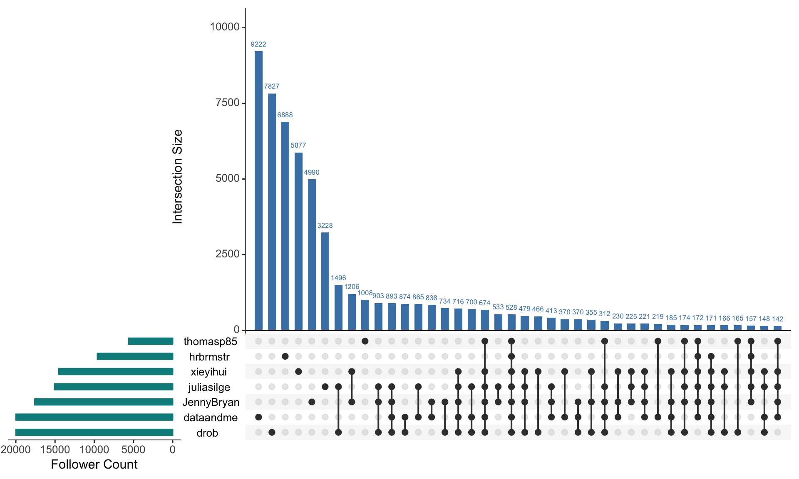

# Visualizing Intersecting Follower Sets with UpSetR

## Problem

You want to examine the intersection of twitter followers between a group of definied twitter handles.

## Solution

- Scrape all follower ID's for each handle
- Combine into one dataframe
- Create de-duplicated list of all followers
- Build a logical matrix to indicate if each follower follows each handle or not
- Plot the intersecting sets with [`UpSetR`](https://github.com/hms-dbmi/UpSetR)

## Discussion

Set visualization, typically done using Venn diagrams, can become challenging when the number of sets exceeds a a trivial threshold. To address this, the UpSet project was born. 

> A novel visualization technique for the quantitative analysis of sets, their intersections, and aggregates of intersections.

Thankfully, there is an R package version of the project that we can use with follower data pulled with `rtweet`. `UpSetR` requires the data to be in a binary matrix format, so there is some data wrangling work to be done before we can visualize.


```r
library(rtweet)
library(tidyverse)
library(UpSetR)
```

First we will make a list of twitter handles we want to compare then scrape all of their followers into a one dataframe using a `get_followers` function inside a `purrr::map_df` call. Set `n` to a number => the max follower count in your set and `retryonratelimit = TRUE` to ensure you capture all followers. This may take some time depending on how may followers you are scraping.


```r
# get a list of twitter handles you want to compare
rstaters <- c("dataandme", 
              "JennyBryan", 
              "hrbrmstr", 
              "xieyihui", 
              "drob", 
              "juliasilge", 
              "thomasp85")

# scrape the user_id of all followers for each handle in the list and bind into 1 dataframe
followers <- rstaters %>%
  map_df(~ get_followers(.x, n = 20000, retryonratelimit = TRUE) %>% 
           mutate(account = .x))

head(followers)
```

```
## # A tibble: 6 x 2
##   user_id            account  
##   <chr>              <chr>    
## 1 347516627          dataandme
## 2 86786449           dataandme
## 3 901331045353754624 dataandme
## 4 916260332598906881 dataandme
## 5 245066121          dataandme
## 6 828212430345994240 dataandme
```

```r
tail(followers)
```

```
## # A tibble: 6 x 2
##   user_id    account  
##   <chr>      <chr>    
## 1 92966425   thomasp85
## 2 3295717490 thomasp85
## 3 219555432  thomasp85
## 4 113125081  thomasp85
## 5 2282250918 thomasp85
## 6 2336317420 thomasp85
```

Next we form a binary matrix by using an `ifelse` inside another `map_df` to ascertain whether or not each follower in the master list follows each of the twitter handles.


```r
# get a de-duplicated list of all followers
aRdent_followers <- unique(followers$user_id)

# for each follower, get a binary indicator of whether they follow each tweeter or not and bind to one dataframe
binaries <- rstaters %>% 
  map_dfc(~ ifelse(aRdent_followers %in% filter(followers, account == .x)$user_id, 1, 0) %>% 
            as.data.frame) # UpSetR doesn't like tibbles

# set column names
names(binaries) <- rstaters

# have a look at the data
glimpse(binaries)
```

```
## Observations: 58,813
## Variables: 7
## $ dataandme  <dbl> 1, 1, 1, 1, 1, 1, 1, 1, 1, 1, 1, 1, 1, 1, 1, 1, 1, ...
## $ JennyBryan <dbl> 1, 1, 1, 1, 0, 1, 0, 0, 1, 1, 0, 1, 0, 0, 0, 0, 0, ...
## $ hrbrmstr   <dbl> 0, 0, 0, 0, 0, 0, 0, 0, 0, 0, 0, 1, 0, 0, 0, 0, 0, ...
## $ xieyihui   <dbl> 1, 0, 0, 0, 0, 1, 0, 0, 0, 0, 0, 0, 0, 0, 0, 0, 0, ...
## $ drob       <dbl> 1, 1, 1, 0, 0, 0, 0, 0, 1, 0, 1, 1, 0, 0, 0, 0, 0, ...
## $ juliasilge <dbl> 1, 1, 1, 0, 0, 1, 0, 0, 1, 1, 1, 0, 0, 0, 0, 0, 0, ...
## $ thomasp85  <dbl> 1, 0, 0, 0, 0, 1, 0, 0, 1, 0, 0, 1, 1, 0, 0, 0, 0, ...
```

Finally, we let `UpSetR` work its magic on the matrix and visualize the intersections...


```r
# plot the sets with UpSetR
upset(binaries, nsets = 7, main.bar.color = "SteelBlue", sets.bar.color = "DarkCyan", 
      sets.x.label = "Follower Count", text.scale = c(rep(1.4, 5), 1), order.by = "freq")
```



## See Also

- [UpSet Project](http://caleydo.org/tools/upset/)
